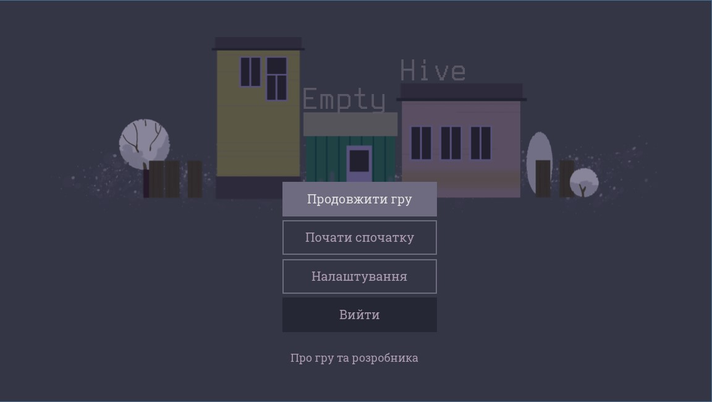
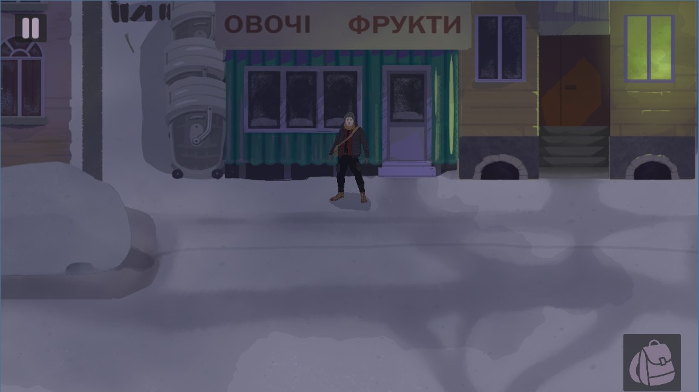
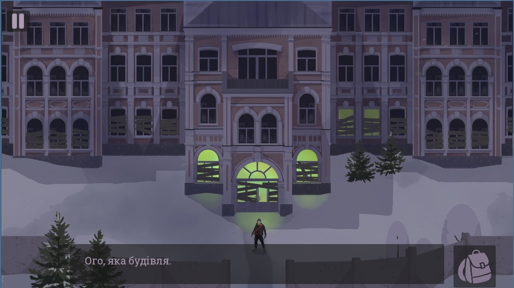
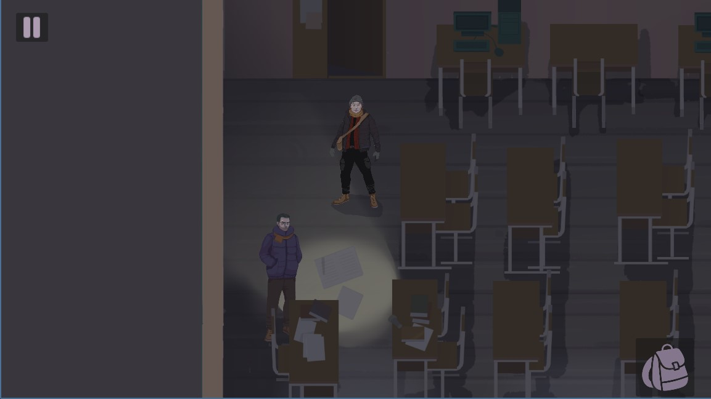
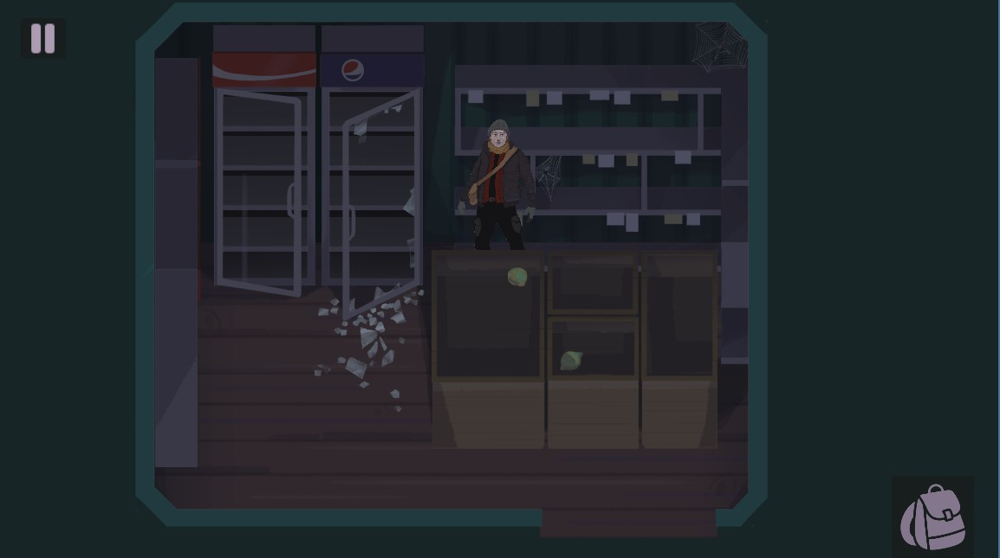
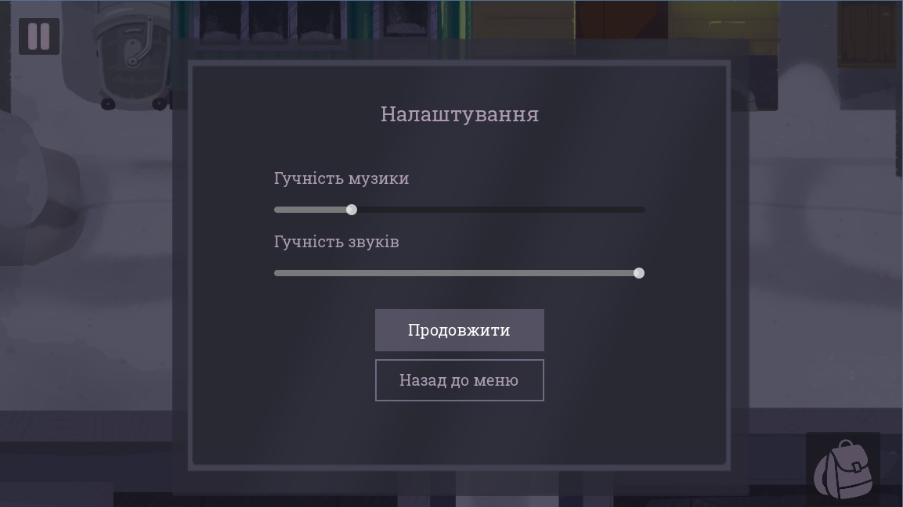
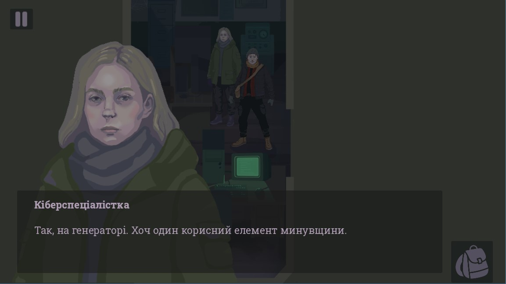
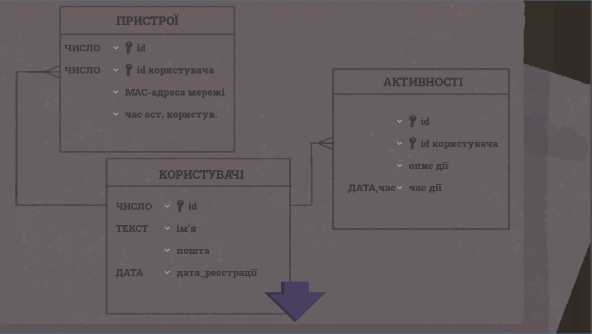

# 🕵️‍♂️ Post-Apocalyptic Detective Game **Empty Hive**
Тут розміщені всі вихідні коди кваліфікаційної роботи на підтвердження ступеня фахового молодшого бакалавра ([ВСП «ППФК НТУ «ХПІ»](http://polytechnic.poltava.ua))

**Керівник роботи** - *Бабич Олександр Вікторович*

## Завдання до дипломної роботи
Розроблений програмний продукт має являти собою гру у жанрі 2D-детектив-хоррор, розроблену на основі рушія Godot. Це рекламний продукт спеціальності 121 - сюжет гри має підводити гравця до рішення вступити на навчання. Слід забезпечити вільне пересування персонажу локаціями і подбати про цікавий геймплей, зручне керування та візуальну привабливість.

## Використані технології
* **Godot** – основний рушій для розробки гри
* **GDScript** – основна мова програмування для логіки гри
* **Krita** – для 2D-графіки
* **Godot Animation Player** – для анімації персонажів, об’єктів, інтерфейсу

## Основна функціональність
* керування персонажем в 2D-просторі
* реалізація механіки розслідування
* діалогова система з персонажами
* система інвентаря
* збереження прогресу, нова гра
* налаштування гучності звуків
* візуальний і звуковий контент
* відповідно до атмосфери

## Локації гри 
* 🏫 Коледж
* 📡 Метеостанція
* 🏪 Магазинчик
* 📚 Бібліотека
* ❄️ Зимові вулиці
  
## Опублікований продукт
Інсталяційний пакет створеної гри можна завантажити з магазину [intch.io](https://sophiazhab.itch.io/empty-hive) або з [розділу релізів](https://github.com/SophiaZhab/diploma_game_godot/releases/tag/v1.3)

## Знімки екрану

